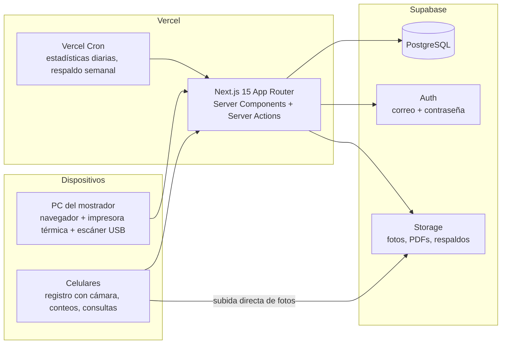

# La Principal 2050 — Arquitectura

Fecha: 2026-09-08. Depende de `01-contexto-y-alcance-mvp.md` (decisiones D1 a D10).

---

## 1. Vista general



- Una sola aplicación Next.js sirve la interfaz y la lógica de servidor. No hay backend separado; la capa de dominio queda aislada para poder extraerse después.
- Toda escritura en la base de datos pasa por el servidor (Server Actions o Route Handlers). El navegador nunca habla con PostgreSQL directamente.
- El navegador sí habla directo con Supabase Auth (sesión) y con Storage (subida de fotos), usando permisos limitados.

---

## 2. Stack y versiones objetivo

| Capa | Elección | Motivo |
|---|---|---|
| Framework | Next.js 15, App Router, TypeScript estricto | Elección del prompt maestro; Vercel lo despliega sin configuración |
| UI | Tailwind CSS 4, shadcn/ui, lucide-react | Componentes accesibles y consistentes; fáciles de adaptar |
| Datos en cliente | TanStack Query, TanStack Table, react-hook-form, Zod | Listas grandes, formularios validados con el mismo esquema que el servidor |
| Estado del POS | Zustand con persistencia en localStorage | El carrito sobrevive a un refresco accidental |
| ORM | Drizzle ORM + drizzle-kit + driver postgres.js | Ligero en serverless, SQL explícito, migraciones versionadas |
| Base de datos | Supabase PostgreSQL 15+, extensiones pg_trgm y unaccent | Búsqueda por texto tolerante a errores y acentos |
| Autenticación | Auth.js (next-auth v5) con usuarios propios en PostgreSQL, contraseñas con bcrypt, sesión JWT | Funciona igual en la PC de desarrollo y en Vercel; los usuarios los crea el administrador, no hace falta el flujo de correos de Supabase Auth |
| Archivos | Adaptador `FileStorage`: disco local en desarrollo, Supabase Storage en producción (bucket `product-photos` público de lectura, `documents` privado) | Fotos de producto no son sensibles; PDFs y respaldos sí |
| Dinero | decimal.js en TypeScript, `numeric(18,4)` en la base | Nunca punto flotante (regla 10 del prompt maestro) |
| Fotos IA | @imgly/background-removal en el navegador, tras una interfaz `PhotoEnhancer` | Sin servidor extra; intercambiable |
| Códigos de barras | bwip-js para generar; html5-qrcode para leer con cámara; escáner USB como teclado | Estándar y gratuito |
| Comprobantes | Vista de impresión HTML para térmica 58/80 mm; @react-pdf/renderer para PDF | Funciona con cualquier impresora con driver de Windows |
| Excel | exceljs para importar y exportar | Plantillas con validación por fila |
| Gráficos | Recharts | Elección del prompt maestro |
| Pruebas | Vitest (dominio e integración con PGlite), Playwright (flujos críticos) | PGlite permite probar SQL real sin Docker |
| Calidad | ESLint, Prettier, GitHub Actions | Bloquea cambios con pruebas rotas |
| Despliegue | Vercel conectado a GitHub; Vercel Cron para tareas programadas | Despliegue automático por rama |

Regiones: Supabase en `us-east-1` y funciones de Vercel en `iad1`, las más cercanas a Venezuela con menor latencia.

---

## 3. Organización del código

```
la-principal-2050/
├── docs/                      # estos documentos
├── src/
│   ├── app/                   # rutas (App Router), layouts, páginas, acciones
│   │   ├── (auth)/login
│   │   ├── (app)/             # área autenticada con sidebar
│   │   │   ├── inicio/  vender/  ventas/  productos/  inventario/
│   │   │   ├── compras/ clientes/ caja/ reportes/ configuracion/
│   │   └── api/               # route handlers: impresión, exportaciones, cron
│   ├── modules/               # un módulo por dominio
│   │   ├── catalog/           # productos, categorías, precios, fotos
│   │   ├── inventory/         # existencias, movimientos, ajustes, conteos
│   │   ├── sales/             # ventas, cotizaciones, devoluciones
│   │   ├── purchasing/        # proveedores, entradas por compra, sugerencias
│   │   ├── cash/              # caja y sesiones
│   │   ├── customers/
│   │   ├── currency/          # monedas, tasas, conversión y redondeo
│   │   ├── reporting/         # consultas de reportes y estadísticas
│   │   ├── auth/              # perfiles, roles, PIN, permisos
│   │   └── audit/
│   │       └── cada módulo:  domain/  application/  infrastructure/  ui/
│   ├── db/                    # schema Drizzle, migraciones, seed
│   ├── lib/                   # supabase clients, money, formato es-VE, i18n
│   └── components/            # UI compartida (shadcn/ui, tablas, formularios)
├── supabase/                  # config local, políticas de Storage, triggers de auth
├── tests/                     # e2e Playwright y fixtures
└── .github/workflows/         # CI
```

Dentro de cada módulo:

- `domain/`: tipos, reglas y cálculos puros (precio con IVA, promedio ponderado, velocidad, redondeo). Sin base de datos ni framework. Aquí va la cobertura de pruebas más alta.
- `application/`: casos de uso (completar venta, aplicar entrada por compra, cerrar caja). Orquestan transacciones y llaman a repositorios.
- `infrastructure/`: repositorios Drizzle, adaptadores de Storage, impresión, Excel.
- `ui/`: componentes y formularios propios del módulo.

---

## 4. Seguridad y acceso

- Auth.js con proveedor de credenciales: correo y contraseña contra la tabla `users` (hash bcrypt). Sesión JWT firmada en cookie segura, expiración por inactividad configurable. Sin registro público: el administrador crea usuarios y restablece contraseñas desde Configuración.
- Tabla `users` con rol (`admin`, `seller`, `warehouse`), PIN cifrado, intentos fallidos y estado.
- Autorización en la capa de aplicación: cada Server Action verifica sesión y rol antes de actuar. El navegador nunca accede a PostgreSQL ni a Storage con credenciales de escritura; las subidas de fotos pasan por el servidor.
- Storage en producción: el bucket `product-photos` permite lectura pública; `documents` es privado y se sirve con URLs firmadas. En desarrollo los archivos van a una carpeta local.
- Cambio rápido de vendedor: el dispositivo mantiene su sesión; al ingresar el PIN de otro usuario se firma una cookie de corta duración con el vendedor activo, y las ventas registran ese vendedor. Los PIN se guardan con hash y se bloquean tras 5 intentos fallidos.
- Secretos solo en variables de entorno de Vercel. Validación con Zod en todas las entradas del servidor. Cabeceras de seguridad y rate limiting básico en login y PIN.

---

## 5. Consistencia de datos

Reglas de implementación que cumplen las reglas 1, 3, 5, 6 y 10 del prompt maestro:

- **Transacciones atómicas:** completar venta, devolver, anular, aplicar entrada por compra, aplicar ajuste o conteo, abrir o cerrar caja: cada una es una transacción de Drizzle.
- **Bloqueo de filas:** dentro de la transacción se toma `SELECT ... FOR UPDATE` sobre `stock_levels` de los productos afectados y sobre la fila de `document_series`, lo que impide sobreventa y numeración duplicada entre dos dispositivos.
- **Numeración:** `UPDATE document_series SET next_number = next_number + 1 RETURNING next_number` en la misma transacción que crea el documento.
- **Kardex solo de inserción:** un trigger impide `UPDATE` y `DELETE` en `inventory_movements`. Cada movimiento guarda el saldo posterior y el costo del momento.
- **Costo promedio:** se recalcula al aplicar una entrada por compra: `nuevo = (stock × costo_actual + cantidad × costo_entrada) ÷ (stock + cantidad)`. Las salidas usan el costo vigente y lo guardan en la línea de venta.
- **Ventas inmutables:** una venta completada no se edita; se corrige con devolución o anulación, que generan sus propios movimientos y registros de auditoría.
- **Dinero:** cálculo con decimal.js, redondeo por línea y por total según la moneda; la base de datos guarda `numeric`, nunca `float`.

---

## 6. Multi-moneda

- `currencies`: USD (base), VES, COP con decimales y redondeo de efectivo.
- `exchange_rates`: una fila por moneda y fecha, con fuente y usuario. El servicio `currency` devuelve la tasa vigente y convierte con redondeo correcto.
- Una venta guarda `rate_ves` y `rate_cop`; cada pago guarda moneda, monto, tasa y `amount_usd`.
- Pantalla de pago: la app muestra el saldo pendiente en las tres monedas y lo actualiza con cada pago agregado. El cambio se calcula en USD y se propone en efectivo USD o COP.
- Mejora opcional: Vercel Cron que descarga la tasa BCV cada mañana y la deja como "pendiente de confirmar" para el administrador.

---

## 7. Fotos de producto

1. El usuario toma la foto con la cámara del celular (`<input type="file" capture="environment">`) o elige un archivo.
2. El navegador reduce la imagen a 1600 px y sube el original a Storage de inmediato.
3. En segundo plano, el navegador ejecuta el recorte (`PhotoEnhancer.browser`): máscara del repuesto, fondo blanco, recorte al contenido con margen del 6 %, lienzo cuadrado 1200 × 1200, exportación WebP y miniatura de 300 px.
4. Vista previa lado a lado; el usuario acepta, conserva el original o repite. Se guardan `original_path`, `processed_path`, `thumb_path` y el estado.
5. Si el recorte falla o el dispositivo es muy lento, la foto queda como original y se puede reprocesar desde una PC.

La interfaz `PhotoEnhancer` tiene un solo método: recibe una imagen y devuelve la imagen procesada o un error. La implementación de navegador es la única del MVP; un adaptador de servicio externo se agrega sin tocar el flujo.

---

## 8. Velocidad de venta y estadísticas

- Tabla `product_stats` con velocidad a 30, 60 y 90 días, días de cobertura, clase ABC, ingresos de 90 días y última venta.
- Se recalcula por un Vercel Cron diario a las 03:00 (hora de Caracas) y con un botón "Recalcular ahora" en Reportes.
- Los productos en modo automático actualizan su punto de reorden y cantidad sugerida en el mismo proceso; los de modo manual conservan los valores del usuario.
- El reporte "Qué comprar" es una consulta sobre `stock_levels`, `stock_settings`, `product_stats` y `product_suppliers`, agrupada por proveedor.

---

## 9. Impresión y comprobantes

- Ticket: página HTML con CSS de impresión para 58 y 80 mm; se imprime desde el navegador con la impresora térmica instalada en Windows. Sin confirmación adicional cuando la impresora predeterminada está configurada.
- Nota de entrega en PDF: generada en servidor, guardada en `documents` y compartida por WhatsApp con un enlace firmado de 7 días.
- Etiquetas: PDF con códigos Code 128 para rollo (50 × 25 mm) o para hoja A4 con cuadrícula.
- Fase 2: impresión ESC/POS directa por WebUSB y apertura de gaveta.

---

## 10. Entornos, despliegue y respaldos

| Entorno | Base de datos | App | Uso |
|---|---|---|---|
| Local | PostgreSQL embebido (paquete `embedded-postgres`, sin instalación ni Docker) | `pnpm dev` | Desarrollo y pruebas |
| Producción | Proyecto Supabase | Vercel, rama `main` | El negocio |

- Variables: `DATABASE_URL` (pooler, puerto 6543) para la app y `DIRECT_URL` (5432) para migraciones; `NEXT_PUBLIC_SUPABASE_URL`, `NEXT_PUBLIC_SUPABASE_ANON_KEY`, `SUPABASE_SERVICE_ROLE_KEY`, `PIN_COOKIE_SECRET`, `CRON_SECRET`.
- Migraciones: `drizzle-kit generate` en desarrollo; `drizzle-kit migrate` en el despliegue (paso previo al build en Vercel).
- Respaldos: exportación completa a Excel y JSON desde Configuración; Vercel Cron semanal que guarda un volcado JSON en el bucket `documents`. Recomendación: plan Pro de Supabase al entrar en operación real.
- Observabilidad: logs de Vercel, errores de servidor registrados con identificador de petición; Sentry opcional.

---

## 11. Decisiones registradas (ADR resumidas)

| ADR | Decisión | Alternativas descartadas | Razón |
|---|---|---|---|
| 1 | Drizzle en lugar de Prisma | Prisma | Menos peso en serverless, SQL explícito para bloqueos y numeración |
| 2 | Autorización en servidor, RLS solo como candado | RLS por rol | 3 roles y un solo cliente; menos políticas que mantener |
| 3 | Recorte de fotos en el navegador | Servicio Python rembg | No hay servidor permanente en Supabase + Vercel |
| 4 | Sin `company_id` multi-empresa | Multi-tenant desde el inicio | Un solo negocio; agregarlo después es una migración acotada. Se conservan `branches` y `warehouses` para multi-sucursal |
| 5 | Sin crédito ni cuentas por cobrar | Módulo completo del prompt | Decisión D5 del dueño |
| 6 | Tickets por impresión del navegador | ESC/POS por WebUSB | Funciona hoy con cualquier impresora; ESC/POS en Fase 2 |
| 7 | Auth.js con usuarios propios en lugar de Supabase Auth | Supabase Auth | La PC de desarrollo no tiene Docker para correr Supabase local; con 3 usuarios creados por el administrador no se necesitan los flujos de correo. Supabase sigue siendo la base de datos y el almacén de archivos en producción |
| 8 | PostgreSQL embebido para desarrollo | Docker, instalación de PostgreSQL | No requiere permisos de administrador ni Docker; mismas extensiones que Supabase |
