# La Principal 2050 — Modelo de datos (Fase 1)

Fecha: 2026-09-08. Todas las tablas llevan `id uuid` (salvo las de solo inserción con `bigserial`), `created_at` y `updated_at`. Las entidades maestras llevan `deleted_at` para borrado lógico. Montos `numeric(18,4)`, cantidades `numeric(18,3)`, tasas `numeric(18,6)`.

Convenciones: nombres en inglés en `snake_case`; sufijo `_usd` para montos en dólares; `currency_code` referencia a `currencies.code`.

---

## 1. Diagrama de entidades

```mermaid
erDiagram
  profiles ||--o{ sales : "seller"
  branches ||--o{ warehouses : has
  branches ||--o{ cash_registers : has

  currencies ||--o{ exchange_rates : has
  currencies ||--o{ payment_methods : "settled in"

  categories ||--o{ categories : parent
  categories ||--o{ products : has
  brands ||--o{ products : has
  units ||--o{ products : has
  taxes ||--o{ products : has
  products ||--o{ product_equivalences : has
  products ||--o{ product_compatibilities : has
  products ||--o{ product_barcodes : has
  products ||--o{ product_images : has
  products ||--o{ product_suppliers : has
  suppliers ||--o{ product_suppliers : has
  price_lists ||--o{ price_list_items : has
  products ||--o{ price_list_items : has
  products ||--o{ price_history : has

  products ||--|| stock_levels : "per warehouse"
  products ||--|| stock_settings : "per warehouse"
  products ||--|| product_stats : has
  products ||--o{ inventory_movements : has
  warehouses ||--o{ inventory_movements : has
  adjustment_reasons ||--o{ inventory_movements : has
  inventory_adjustments ||--o{ inventory_adjustment_items : has
  stock_counts ||--o{ stock_count_items : has

  suppliers ||--o{ purchase_receipts : has
  purchase_receipts ||--o{ purchase_receipt_items : has

  customers ||--o{ sales : has
  customers ||--o{ quotes : has
  price_lists ||--o{ customers : assigned
  quotes ||--o{ quote_items : has
  quotes ||--o| sales : "converted to"
  sales ||--o{ sale_items : has
  sales ||--o{ sale_payments : has
  payment_methods ||--o{ sale_payments : has
  sales ||--o{ sale_returns : has
  sale_returns ||--o{ sale_return_items : has

  cash_registers ||--o{ cash_sessions : has
  cash_sessions ||--o{ cash_session_balances : "per cash currency"
  cash_sessions ||--o{ cash_movements : has
  cash_sessions ||--o{ sales : has

  document_series ||--o{ sales : numbers
  profiles ||--o{ audit_logs : writes
```

---

## 2. Organización y acceso

**branches** — `id, name, code, address, phone, is_active`. Una fila en el MVP.

**warehouses** — `id, branch_id, name, code, is_active`. Una fila en el MVP.

**profiles** — `id` (igual a `auth.users.id`), `name, email, role` (`admin | seller | warehouse`), `pin_hash, pin_failed_attempts, pin_locked_until, is_active, last_login_at`. Trigger en `auth.users` que crea la fila.

**settings** — `key text pk, value jsonb, updated_by, updated_at`. Claves iniciales: `company` (nombre, RIF, dirección, teléfono, logo), `policies` (`allow_negative_stock`, `max_discount_pct_by_role`, `void_window_hours`, `quote_validity_days`, `cop_cash_rounding`), `printing` (ancho de ticket, pie de página), `stats` (ventanas y niveles de servicio).

**document_series** — `id, document_type` (`sale | quote | return | purchase_receipt | adjustment | count | cash_session`), `prefix, next_number, padding`. Única por tipo. Ejemplo: `V-000123`.

**audit_logs** (solo inserción) — `id bigserial, user_id, action, entity_type, entity_id, before jsonb, after jsonb, ip, user_agent, created_at`.

---

## 3. Monedas

**currencies** — `code pk` (`USD | VES | COP`), `name, symbol, decimals, cash_rounding` (USD 0.01, VES 0.01, COP 100), `is_base, is_active`.

**exchange_rates** — `id, currency_code, rate` (unidades por 1 USD), `effective_date, source` (`manual | bcv_api`), `created_by, created_at`. Única por `(currency_code, effective_date)`. La tasa vigente es la de fecha más reciente menor o igual a hoy.

---

## 4. Catálogo

**categories** — `id, parent_id, name, slug, sort_order, is_active`. Árbol de dos o tres niveles (Refrigeración → Compresores → Embraco).

**brands** — `id, name, is_active`. Marca del repuesto (Embraco, Danfoss, Tecumseh, genérico).

**units** — `id, name, symbol, decimals` (Unidad 0, Metro 2, Kilogramo 3, Libra 3, Par 0, Juego 0).

**taxes** — `id, name, rate` (0.16), `is_default, is_active`. IVA 16 % y Exento 0 %.

**products** — `id, sku unique, part_number, name, description, category_id, brand_id, unit_id, tax_id, warranty_days, location_code, cost_avg_usd, cost_last_usd, attributes jsonb, is_active, deleted_at`. Índices: `sku`, `part_number`, trigram sobre `name` y `part_number` con `unaccent`.

**product_equivalences** — `id, product_id, code, brand, notes`. Otros códigos con los que se conoce el mismo repuesto. Única `(product_id, code)`; índice trigram sobre `code`.

**product_compatibilities** — `id, product_id, appliance_type` (nevera, lavadora, aire acondicionado, cocina, microondas, secadora…), `brand, model, notes`. Índice trigram sobre `brand || model`.

**product_barcodes** — `id, product_id, code unique, type` (`EAN13 | UPC | CODE128 | INTERNAL`), `is_primary`. Los internos se generan con prefijo `20` + 10 dígitos + verificador.

**product_images** — `id, product_id, original_path, processed_path, thumb_path, sort_order, is_primary, status` (`pending | processed | original_only | failed`), `created_by`.

**suppliers** — `id, name, tax_id, contact_name, phone, email, address, currency_code, lead_time_days, payment_terms, notes, is_active, deleted_at`.

**product_suppliers** — `product_id, supplier_id` (clave compuesta), `supplier_code, last_cost_amount, last_cost_currency, last_cost_usd, last_purchase_at, pack_size`.

**price_lists** — `id, code` (`PUBLIC | TECH`), `name, is_default, is_active`.

**price_list_items** — `id, price_list_id, product_id, price_usd, tax_included` (true), `updated_by`. Única `(price_list_id, product_id)`.

**price_history** — `id, product_id, price_list_id, old_price_usd, new_price_usd, changed_by, changed_at`.

---

## 5. Inventario

**stock_levels** — `product_id, warehouse_id` (clave compuesta), `quantity, reserved_qty, updated_at`. Disponible = `quantity − reserved_qty`. Se bloquea con `FOR UPDATE` en toda transacción que la modifique.

**stock_settings** — `product_id, warehouse_id` (clave compuesta), `min_stock, max_stock, reorder_point, reorder_qty, mode` (`manual | auto`), `updated_by`.

**adjustment_reasons** — `id, name, kind` (`increase | decrease | both`), `is_active`. Semilla: Merma, Daño, Error de conteo, Uso interno, Garantía, Inventario inicial, Otro.

**inventory_movements** (solo inserción; trigger bloquea update y delete) — `id bigserial, product_id, warehouse_id, type` (`purchase_in | manual_in | sale_out | manual_out | adjust_in | adjust_out | return_in | count_adjust | initial`), `quantity` (con signo), `unit_cost_usd, total_cost_usd, balance_after, reference_type, reference_id, reason_id, user_id, notes, created_at`. Índices por `(product_id, created_at)` y por `(reference_type, reference_id)`.

**inventory_adjustments** — `id, number, warehouse_id, reason_id, status` (`draft | applied | cancelled`), `notes, created_by, applied_by, applied_at`.

**inventory_adjustment_items** — `id, adjustment_id, product_id, quantity_delta, unit_cost_usd, notes`.

**stock_counts** — `id, number, warehouse_id, filter jsonb` (categoría o ubicación), `status` (`open | applied | cancelled`), `blind` (bool), `started_by, started_at, applied_by, applied_at, notes`.

**stock_count_items** — `id, count_id, product_id, expected_qty, counted_qty, difference, counted_by, counted_at`.

**product_stats** — `product_id pk, warehouse_id, velocity_30, velocity_60, velocity_90, days_of_cover, abc_class, revenue_90_usd, units_90, last_sale_at, first_stock_at, suggested_reorder_point, suggested_qty, status` (`buy_now | soon | ok | excess | no_data`), `computed_at`.

---

## 6. Compras

**purchase_receipts** — `id, number, supplier_id, warehouse_id, supplier_document, receipt_date, currency_code, exchange_rate, subtotal_usd, extra_costs_usd, total_usd, notes, status` (`draft | applied | voided`), `created_by, applied_at`.

**purchase_receipt_items** — `id, receipt_id, product_id, quantity, unit_cost_amount` (en la moneda del documento), `unit_cost_usd, extra_cost_share_usd, unit_cost_final_usd, line_total_usd`. Al aplicar: movimiento `purchase_in`, recálculo del costo promedio con `unit_cost_final_usd`, actualización de `product_suppliers`.

---

## 7. Clientes

**customers** — `id, kind` (`person | company`), `doc_type` (`V | E | J | G | P | NONE`), `doc_number, name, phone, email, address, customer_type` (`public | technician`), `price_list_id, notes, is_active, deleted_at`. Índice único parcial sobre `(doc_type, doc_number)` cuando no es `NONE`.

---

## 8. Ventas

**quotes** — `id, number, customer_id, seller_id, price_list_id, status` (`open | accepted | converted | expired | cancelled`), `valid_until, subtotal_usd, discount_usd, tax_usd, total_usd, rate_ves, rate_cop, notes, reserves_stock` (bool), `created_by`.

**quote_items** — `id, quote_id, product_id, description, quantity, unit_price_usd, discount_type, discount_value, tax_rate, tax_usd, line_total_usd`.

**sales** — `id, number, branch_id, warehouse_id, cash_session_id, customer_id, seller_id, price_list_id, status` (`held | completed | voided | refunded | partially_refunded`), `sale_date, subtotal_usd, discount_usd, tax_usd, total_usd, paid_usd, change_usd, change_currency_code, change_amount, rate_ves, rate_cop, notes, quote_id, void_reason, voided_by, voided_at, created_by`. Las ventas `held` no tienen número ni movimientos; al completarse reciben número y descuentan stock.

**sale_items** — `id, sale_id, product_id, description, quantity, unit_price_usd, unit_cost_usd, discount_type` (`pct | amount`), `discount_value, tax_rate, tax_usd, line_total_usd, returned_qty, discount_authorized_by`.

**sale_payments** — `id, sale_id, payment_method_id, currency_code, amount, exchange_rate, amount_usd, reference, created_at`.

**sale_returns** — `id, number, sale_id, status` (`completed | voided`), `reason_id, restock` (bool), `refund_method_id, refund_currency_code, refund_amount, refund_amount_usd, total_usd, notes, created_by`.

**sale_return_items** — `id, return_id, sale_item_id, product_id, quantity, unit_price_usd, line_total_usd`.

---

## 9. Caja

**payment_methods** — `id, code, name, kind` (`cash | mobile_payment | card_terminal | transfer | crypto`), `currency_code, requires_reference, counts_in_drawer, surcharge_pct` (IGTF, 0 por defecto), `is_active, sort_order`. Semilla: Efectivo USD, Efectivo COP, Zelle, Binance, Punto de venta, Pago Móvil.

**cash_registers** — `id, branch_id, name, is_active`. Una fila.

**cash_sessions** — `id, number, register_id, status` (`open | closed`), `opened_by, opened_at, closed_by, closed_at, closing_summary jsonb` (totales por método y moneda al cierre), `notes, closing_notes`.

**cash_session_balances** — `id, session_id, currency_code, opening_amount, sales_cash, refunds_cash, movements_in, movements_out, expected_amount, counted_amount, difference, justification`. Una fila por moneda de efectivo (USD y COP).

**cash_movements** — `id, session_id, type` (`in | out`), `currency_code, amount, reason, authorized_by, created_by, created_at`.

---

## 10. Importación y respaldos

**import_jobs** — `id, type` (`products | customers | suppliers | initial_stock | prices`), `file_path, status` (`validating | ready | applied | failed | undone`), `total_rows, ok_rows, error_rows, errors jsonb, created_by, applied_at`.

**backups** — `id, file_path, size_bytes, kind` (`manual | scheduled`), `created_by, created_at`.

---

## 11. Reglas verificadas con pruebas

| Regla | Prueba |
|---|---|
| Dos dispositivos venden la última unidad | Integración: dos transacciones concurrentes; una falla con "stock insuficiente" |
| Numeración consecutiva sin huecos | Integración: 50 ventas en paralelo generan 50 números consecutivos |
| Costo promedio ponderado | Unitaria: entradas sucesivas con costos distintos |
| IVA incluido en precio | Unitaria: base y tasa de una línea y del total, redondeo por moneda |
| Pagos mixtos y cambio | Unitaria: pagos en tres monedas, saldo y cambio en USD y COP con redondeo a 100 |
| Devolución parcial | Integración: reingreso al stock, `returned_qty`, estado `partially_refunded` |
| Anulación fuera de ventana | Integración: rechazo salvo administrador con motivo |
| Velocidad y sugerencia | Unitaria: ventana con días sin stock, clase ABC, semáforo |
| Kardex inmutable | Integración: `UPDATE` y `DELETE` fallan |
| Cierre de caja | Integración: esperado por moneda cuadra con pagos, reembolsos y movimientos |
